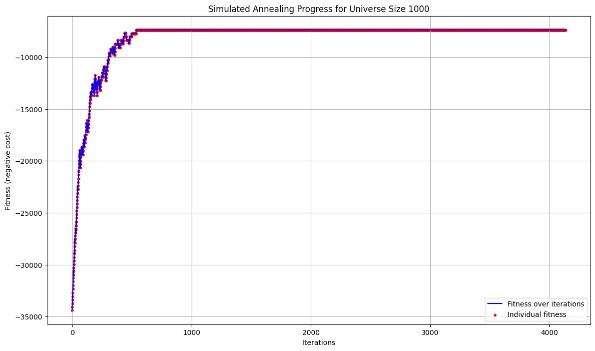
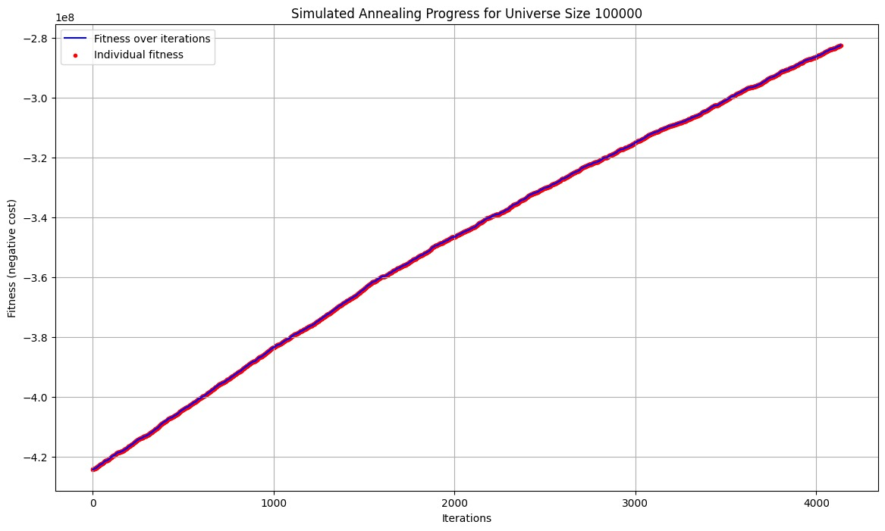
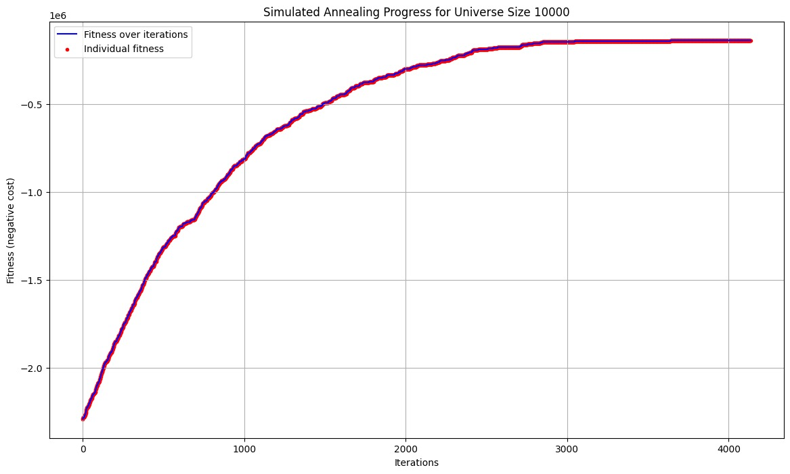
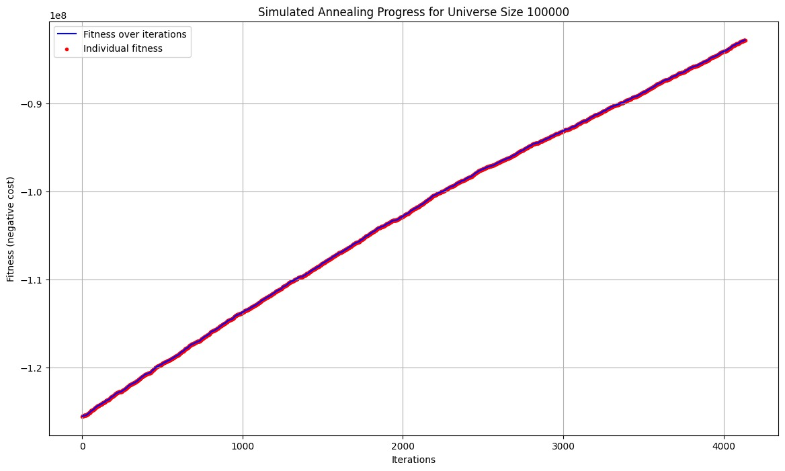
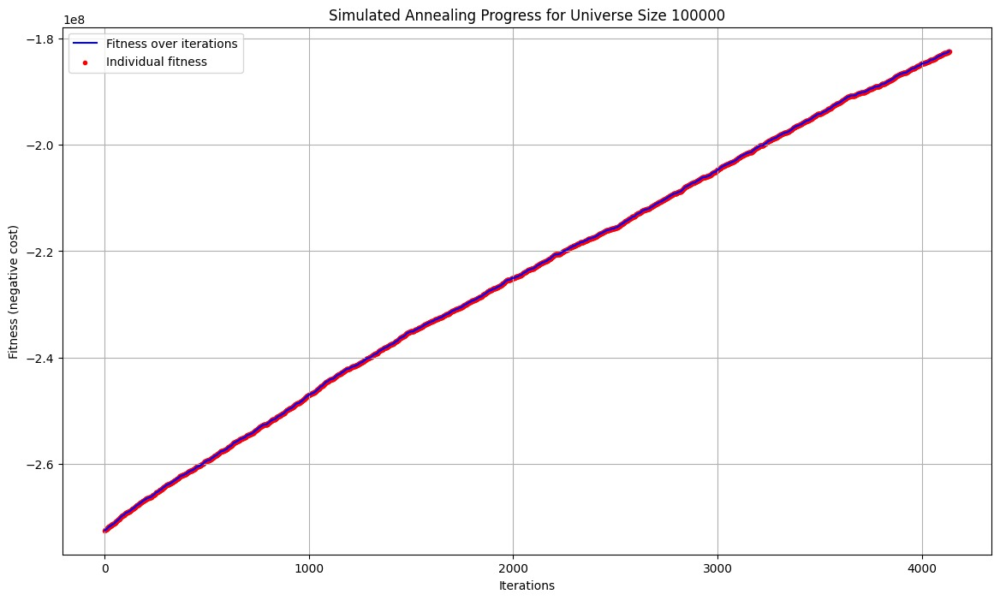
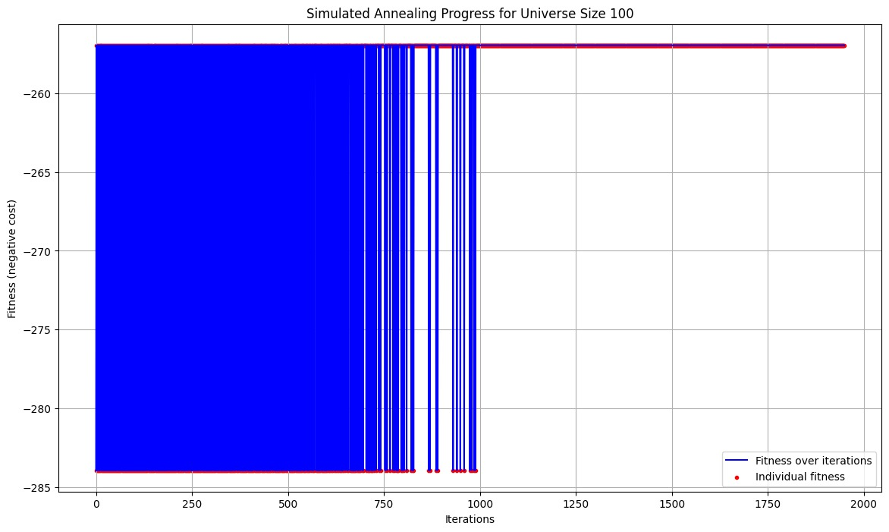

# CI2024_lab1

In the solution of the Set Covering Problem i am used a Simulated Anealling algorithm because it handles large-scale combinatorial problems with many variables well, like the instances involving large universes and many sets to cover.

The case observed are the following, in this way I noticed that perhaps if we had lowered the minimum temperature threshold we could have noticed a better adjustment of the fitness curve also in the last three cases

### 1. universe size: 100; num sets: 10; density: 0.2

### 2. universe size: 1000; num sets: 100; density: 0.2

### 3. universe size: 10000; num sets: 1000; density: 0.2

### 4. universe size: 100000; num sets: 10000; density: 0.1

### 5. universe size: 100000; num sets: 10000; density: 0.2

### 6. universe size: 100000; num sets: 10000; density: 0.3

#

Collaborators: 
- Carlo di Pantaleo s333106 https://github.com/carlopantax
- Sergio Lampidecchia s331080  https://github.com/sergiolampidecchia 

